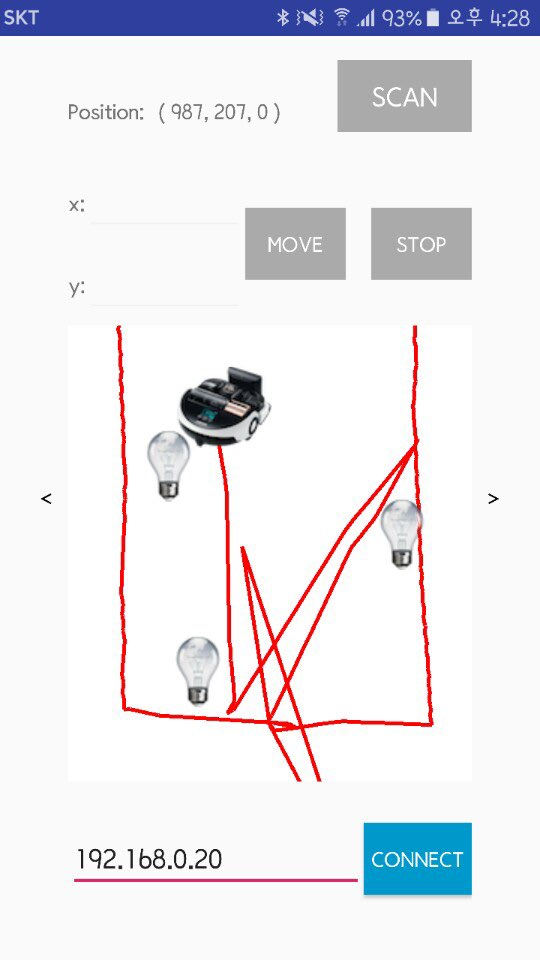

# Moving Gateway
Moving Gateway(MGW) is a project that move around the home through RVC(Robot Vaccum Cleaner) and enable users to access sensors and actuators in all rooms of the home, even in radio shadow area.

# Components
* client-app: MGW client applicaiton running on Android (user device)
* server-service: MGW server service running on Tizen RVC device (moving gateway)
* signal-observatory: Signal observatory that observe the signal strength of each things in the home (moving gateway)
* signal-lighthouse: Signal lighthouse that makes signals observable by signal observatory (thing device)

# Branches
* master: main branch
* client-app: MGW client application
* server-service: MGW server service
* signals: Signal observatory and signal lighthouse

